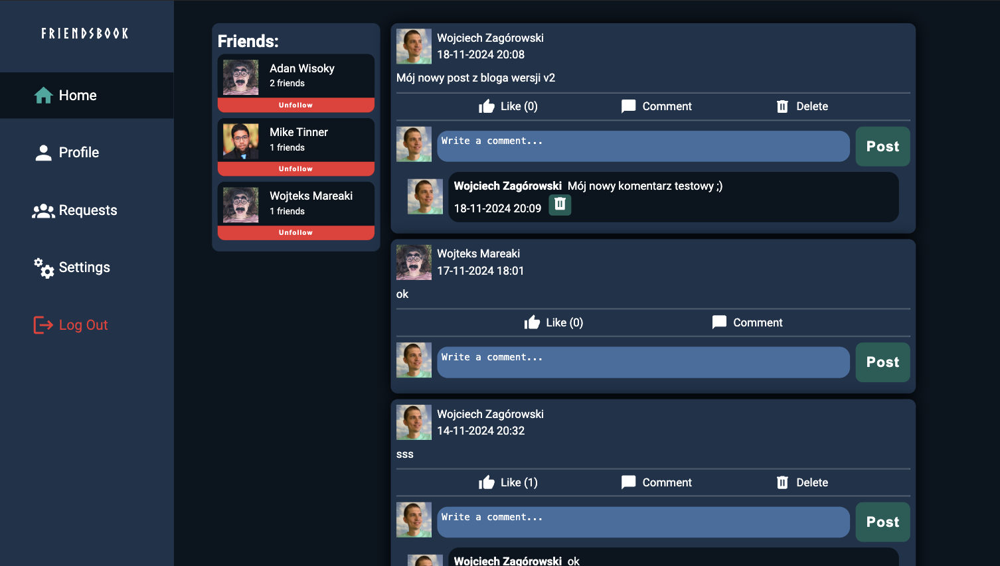
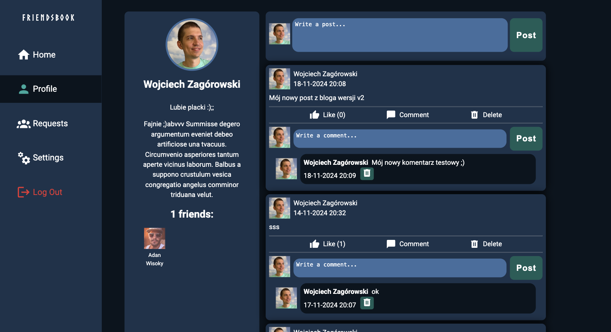
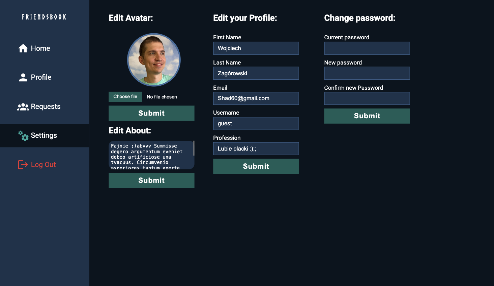
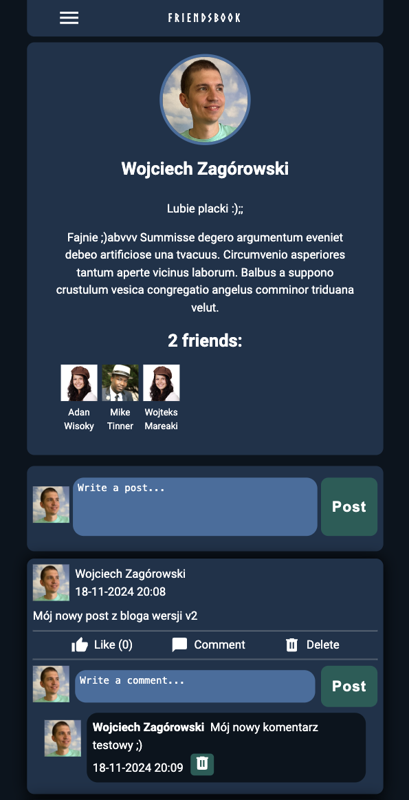
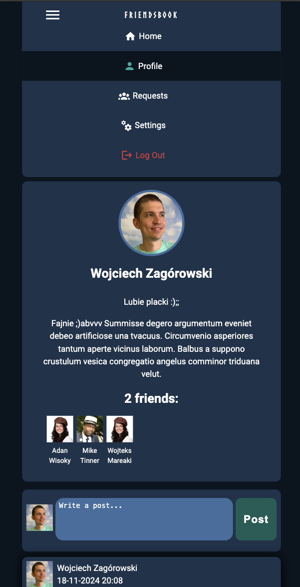

# Odin Book

[](https://odin-books.netlify.app/)  
[](https://github.com/BigWojtek7/odin-book-backend)

Odin Book is a simplified social networking app inspired by Facebook, created as part of [The Odin Project](https://www.theodinproject.com/). This application allows users to register, make friends, create posts and comments, and manage their profiles and privacy settings.



## Features

### User Registration & Authentication

- **Register and Log In**: Users must register to create posts, add comments, and interact with others.
- **JWT Token Authentication**: Secure authentication with JSON Web Tokens (JWT), managed via Node.js and Express on the server.

### Posts & Comments

- **Create and View Posts**: Users can create posts visible to their friends and themselves.
- **Commenting**: Comments can be added to posts for interaction among friends.
- **Likes**: Users can like posts.
- **Delete Options**: Users can delete their own posts and comments.

### Friends Management

- **Send Friend Requests**: Add friends by sending a friend request. The other user must accept for the connection to be established.
- **Accept/Reject Friend Requests**: Manage friend requests in the **Requests** tab, where incoming requests can be accepted or rejected.
- **Friend Post Feed**: The **Home** feed shows posts from the user and their friends, along with any comments on these posts.

### Profile & Privacy

- **View Profile**: Access your profile to see your posts and personal information.
- **Edit Profile Settings**: In the **Settings** section, users can update personal information, ensuring their profile is always current.
- **Manage Friends**: Remove friends directly from the **Home** page if desired.

### Responsive Design

- **Mobile-Friendly**: Odin Book is fully responsive and optimized for mobile devices, providing a seamless experience across different screen sizes.

### Testing

- **Well-Tested**: The application has undergone thorough testing to ensure smooth operation and handle any edge cases.

## Getting Started

### Prerequisites

- **Node.js**: Ensure you have Node.js installed on your machine.
- **PostgreSQL**: Odin Book requires a PostgreSQL instance for data storage.
- **Environment Variables**: JWT secrets, database connection URLs, and other sensitive data are managed via environment variables.

### Installation

1. Clone the repository:
   ```bash
   git clone https://https://github.com/BigWojtek7/odin-book-frontend.git
   ```
2. Navigate to the project directory:
   ```bash
   cd odin-book-frontend
   ```
3. Install dependencies:
   ```bash
   npm install
   ```
4. Set up environment variables:
   - Create a `.env` file in the root directory.
   - Add the required environment variables (e.g., `JWT_SECRET`, `DB_URI`, etc.).
5. Start the server:
   ```bash
   npm run dev
   ```

## Server & API

The application is powered by a Node.js and Express server, handling:

- User authentication with JWT
- CRUD operations for posts, comments, friends, and friend requests
- Profile and settings management

## Technologies Used

- **Frontend**: React, Module CSS for responsive design
- **Backend**: Node.js, Express
- **Database**: PostgreSQL
- **Authentication**: JSON Web Tokens (JWT)
- **Testing**: Jest / Mocha / Chai (based on your preference and setup)

## Screenshots

- **Home Feed**: 
- **Profile Page**: 
- **Settings**: 
- **Mobile layout**:
<p align="center">
  
  
</p>

## License

This project is licensed under the MIT License - see the [LICENSE](LICENSE) file for details.

## Acknowledgements

This project was created as part of [The Odin Project](https://www.theodinproject.com/), which provides free resources for learning web development.
